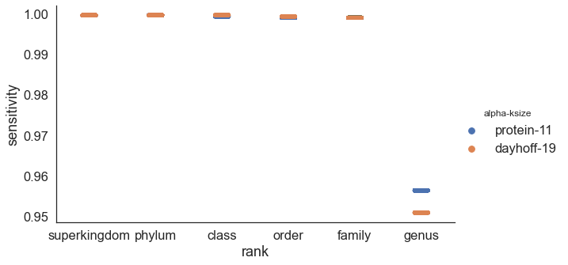

## Results

	
### Protein k-mers enable similarity searches at increased evolutionary distances 
**(DNA vs Protein)**
_(just containment, no ANI/AAI?)_
_dayhoff or just protein?_

Protein sequences are more conserved than their underlying DNA sequences. Whole-proteome MinHash sketches are more similar than whole-genome DNA sketches, enabling us to find protein-level similarity across divergent genomes.

For , e.g. Pseudomonas, XX% of k-mers are shared within the chosen/published genomes within species. For all published genomes within the genus, a median of xx% of k-mers are shared between genomes of one species and genomes of the a different species in the same genus.

at ksize of 10...
-xx% of DNA k-mers are shared within-species
-yy% of protein k-mers are shared within-species
- zz% of DNA k-mers are shared within-genus
... etc 
== median or mean containment at rank?
containent = % of a genome's k-mers that are shared
-- do using ALL of gtdb, BUT, start with just a single set of genomes.. e.g. Pseudomonas? == similar to "shared k-mers" paper [@doi:10.24072/pci.genomics.100001]

{#fig:evolpathsContain}

{#fig:evolpathsANI}

#### k-size selection for optimal comparisons / distance estimation

- num shared k-mers at different ksizes
- 	e.g. k=7 much more common -- share far more k-mers. I assumed this would hurt, rather than help classification. Check!
-   do rankinfo on each database??

because kmer size matters --> conversion to AAI is useful!?
conversion to AAI does two things: accounts for k-mer length, ...

### Protein containment searches enable Sensitive/fast/accurate taxonomic classification
_(just containment, no ANI/AAI)_

to do, classification:
0. fix thumper (refactor branch) --> working + tests
1. implement "leave one xx clade out classification check"
 --> instead of just ignoring exact matches, ignore any matches in same species/genus/family
2. prelim figure for tara classification vs GTDB-Tk vs BAT
  - classification of incomplete genomes
  - for "contaminated" genomes .. can we randomly add contigs from diff species, see the impact? Like classification still works until xx% contaminated with something present in our database?
3. ksize diffs for classification? k=7 vs k=10 vs k=11?
  - time, sensitivity, specificity
4. virus development! (could be separate paper)

While more protein k-mers are shared across genomes within the same genus (and different species), min-set-cov + LCA allows us to find/report the most similar genome.

#### benchmarking :: Leave one out classification
_leave one clade out version? see CAT/BAT paper )_

[protein vs dna]

{#fig:classification_sensitivity}

include 6-frame translation works well for database search
(sensitivity/specificity of Prodigal-translated vs 6-frame translated)

CAT/BAT paper [@doi:10.1186/s13059-019-1817-x]
("cat" = contig annotation, "bat" = bin annotation)

main point: more k-mers are shared = more k-mers available for matching

#### Classification of incomplete and contaminated genomes

#### virus classification

#### euk classification?? Too much.

### Containment-AAI enable alignment-free phylogenomic reconstruction
_evolpaths analysis_

Containment searches enable similiarity estimation, especially between genomes of different lengths. 

Max containment normalizes the shared content by the smaller of the two genomes

![**Max Containment to ANI and AAI.** 
Containment calculation is guaranteed to be more similar to traditional calculation of Average Nucleotide Identity and Average Amino Acid Identity, which compared only the sections of genome that align. The shared k-mer content (containment numerator) can be thought of as the alignable sections of the genomes. 
The denominator of the Jaccard index is the alignable sections + the unalignable sections. 
The lower bound of the containment denominator will be the exact same as the numerator at 100% containment, where all k-mers are found within the comparison dataset. The upper bound will be the same as the Jaccard denominator, where all k-mers of the comparison dataset are found within the query dataset, and it is the query that contains any additional nonshared k-mers/unalignable sequence.
](images/containment-ANI-AAI.png){#fig:containmentANI}

### median AAI across GTDB?	

#### alphabet and k-size selection for optimal distance estimation

- num shared k-mers at different ksizes
- 	e.g. k=7 much more common -- do rankinfo on each database! 

### Comparison with other alignment-free methods (advantages, disadvantages, etc)

Alignment-based metrics are looking at the specific sequence variation of aligned regions, while k-mer based comparisons are comparing shared k-mers vs distinct k-mers. Since each nucleotide polymorphims generates mutated k-mers with an expected frequency, k-mer containment estimates can be used to accurately estimate both the Average Nucleotide Identity and Average Amino Acid Identity  [@doi:10.1101/2021.01.15.426881; @doi:10.1186/s13059-016-0997-x]
