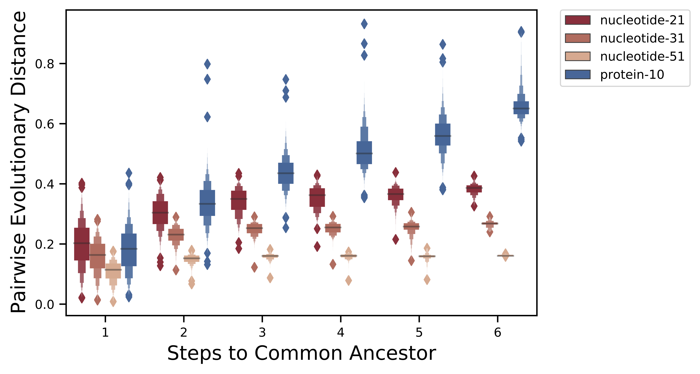

## Results

### Accurate distance estimation from Maximum Containment
_(Correlation between Scaled MinHash Containment and ANI)_

Containment searches enable similiarity estimation, especially between genomes of different lengths.
Max containment normalizes the shared content by the smaller of the two genomes

![**Max Containment to ANI and AAI.** 
Containment calculation is guaranteed to be more similar to traditional calculation of Average Nucleotide Identity and Average Amino Acid Identity, which compared only the sections of genome that align. The shared k-mer content (containment numerator) can be thought of as the alignable sections of the genomes. 
The denominator of the Jaccard index is the alignable sections + the unalignable sections. 
The lower bound of the containment denominator will be the exact same as the numerator at 100% containment, where all k-mers are found within the comparison dataset. The upper bound will be the same as the Jaccard denominator, where all k-mers of the comparison dataset are found within the query dataset, and it is the query that contains any additional nonshared k-mers/unalignable sequence.
](images/containment-ANI-AAI.png){#fig:containmentANI}

To assess the utility of Scaled MinHash techniques across evolutionary distance, we generated a series of "evolutionary paths" from the set of 31k representative GTDB genomes.
Each evolutionary path offers six genome similarity comparisons at a range of evolutionary distances. 
For each genome comparison, we estimated Average Nucleotide Identity (ANI) using fastANI [@doi:10.1038/s41467-018-07641-9] and Average Amino Acid Identity (AAI) using compareM [@url: https://github.com/dparks1134/CompareM].

{#fig:evolpathsANIvsfastANI}

### Similarity detection and clustering at increased evolutionary distances

Protein k-mers! <compare heatmap w/ max containment for subset of gtdb data?>

{#fig:evolpathsAAIvsCompareM}

**(DNA vs Protein)**
- _(just containment, no ANI/AAI)_
- _include dayhoff or just protein?_

K-mer analysis methods enable similarity detection as low as a single shared k-mer between divergent genomes. As a result, exact matching long nucleotide k-mers can be used for taxonomic classification between closely related genomes, including at the strain, species, and genus level (k-mer lengths 51, 31, and 21, respectively). At larger evolutionary distances, accumulated nucleotide divergence limits the utility of exact nucleotide k-mer matching. 

As protein sequences are more conserved than their coding nucleotide sequences, exact matching of protein k-mers can detect sequence similarity in spite of synonymous nucleotide substitutions that may have accumulated across the two sequences.

Exact matching of k-mers has long been deemed a shortcoming for k-mer based analyses, limiting similarity detection power across larger evolutionary distances. However, protein k-mers (and k-mers leveraging reduced protein alphabets) 

Protein sequences are more conserved than their underlying DNA sequences. Whole-proteome MinHash sketches are more similar than whole-genome DNA sketches, enabling us to find protein-level similarity across divergent genomes. 

For , e.g. Pseudomonas, XX% of k-mers are 	shared within the chosen/published genomes within species. For all published genomes within the genus, a median of xx% of k-mers are shared between genomes of one species and genomes of the a different species in the same genus.

rankinfo ... 	at ksize of 10...
-xx% of DNA k-mers are shared within-species
-yy% of protein k-mers are shared within-species
- zz% of DNA k-mers are shared within-genus
... etc 
== median or mean containment at rank?
containent = % of a genome's k-mers that are shared
-- do using ALL of gtdb, BUT, start with just a single set of genomes.. e.g. Pseudomonas? == similar to "shared k-mers" paper [@doi:10.24072/pci.genomics.100001]

{#fig:evolpathsContain}

{#fig:evolpathsContain}

{#fig:evolpathsANI}

### Alignment-free phylogeny recapitulates core-genome phylogeny

{#fig:evolpathsANIAAI}

### Robust taxonomic classification using Sourmash Gather

Ref databases are incomplete (may not have good representation of sp. of interest).
Query genomes /mags/ metagenomes are incomplete.

#### Benchmarking Taxonomic Classification

First, we benchmarked protein-based gather classification using the high quality, highly complete reference genomes within the GTDB representative genome set.
For each genus, we randomly selected one reference genome for inclusion in the benchmarking reference database (n=9428).
For each genus with at least two species clusters, we randomly selected a second species within that genus for the test set of genomes (n=3911).
Thus, each test genome shares genus-level taxonomy with one (and only one) genome in the reference database.
Since we know that no test genome shares species-level taxonomy with the reference database, we used the lowest/least common ancestor approach described above to report taxonomic classifications at the genus level.
To assess the impact of 6-frame translation of nucleotide sequence on classification accuracy, we compared classification accuracy between published proteome queries and (6-frame) translated genome queries.
Using the same reference database, we selected an environmental dataset [@doi:] to assess the impact of genome completeness on taxonomic classification.

We compared gather-LCA classification to `GTDB-Tk`, a tool ...

We also generated nucleotide and protein Scaled MinHash reference databases for all GTDB representative genomes (release 95, n=31,910).

#### Classification is robust to incompleteness of query genome and reference database

#### Classification is robust to query genome contamination

	