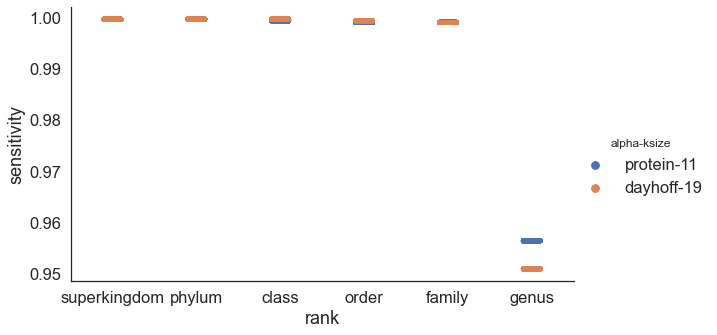

## To Do

#### k-size selection for optimal comparisons / distance estimation

- num shared k-mers at different ksizes
- 	e.g. k=7 much more common -- share far more k-mers. I assumed this would hurt, rather than help classification. Check!
-   do rankinfo on each database??

because kmer size matters --> conversion to AAI is useful!?
conversion to AAI does two things: accounts for k-mer length, ...

### Classification

0. fix thumper (refactor branch) --> working + tests
1. implement "leave one xx clade out classification check"
 --> instead of just ignoring exact matches, ignore any matches in same species/genus/family
2. prelim figure for tara classification vs GTDB-Tk vs BAT
  - classification of incomplete genomes
  - for "contaminated" genomes .. can we randomly add contigs from diff species, see the impact? Like classification still works until xx% contaminated with something present in our database?
3. ksize diffs for classification? k=7 vs k=10 vs k=11?
  - time, sensitivity, specificity
4. virus testing?

#### benchmarking :: Leave one out classification
_leave one clade out version? see CAT/BAT paper )_

[protein vs dna]

{#fig:classification_sensitivity}

include 6-frame translation works well for database search
(sensitivity/specificity of Prodigal-translated vs 6-frame translated)

CAT/BAT paper [@doi:10.1186/s13059-019-1817-x]
("cat" = contig annotation, "bat" = bin annotation)

main point: more k-mers are shared = more k-mers available for matching

#### Classification of incomplete and contaminated genomes

#### virus classification

#### euk classification?? Too much.

### median AAI across GTDB?	

#### alphabet and k-size selection for optimal distance estimation

- num shared k-mers at different ksizes
- 	e.g. k=7 much more common -- do rankinfo on each database! 

### Comparison with other alignment-free methods (advantages, disadvantages, etc)

Alignment-based metrics are looking at the specific sequence variation of aligned regions, while k-mer based comparisons are comparing shared k-mers vs distinct k-mers. Since each nucleotide polymorphims generates mutated k-mers with an expected frequency, k-mer containment estimates can be used to accurately estimate both the Average Nucleotide Identity and Average Amino Acid Identity  [@doi:10.1101/2021.01.15.426881; @doi:10.1186/s13059-016-0997-x]

Using nucleotide k-mers
This property allows for low-level homology detection at the n

### Add'l thoughts, etc

	** core vs accessory distances **
	ANI/AAI == really getting at _core_
