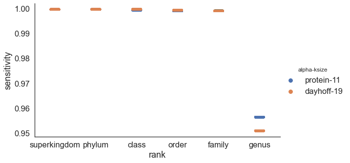

---
title: Scaled MinHash Containment enables alignment-free distance estimation across the tree of life
keywords:
- metagenomics
- OGRI
- ANI
lang: en-US
date-meta: '2021-01-25'
author-meta:
- N. Tessa Pierce-Ward
- C. Titus Brown
header-includes: |-
  <!--
  Manubot generated metadata rendered from header-includes-template.html.
  Suggest improvements at https://github.com/manubot/manubot/blob/main/manubot/process/header-includes-template.html
  -->
  <meta name="dc.format" content="text/html" />
  <meta name="dc.title" content="Scaled MinHash Containment enables alignment-free distance estimation across the tree of life" />
  <meta name="citation_title" content="Scaled MinHash Containment enables alignment-free distance estimation across the tree of life" />
  <meta property="og:title" content="Scaled MinHash Containment enables alignment-free distance estimation across the tree of life" />
  <meta property="twitter:title" content="Scaled MinHash Containment enables alignment-free distance estimation across the tree of life" />
  <meta name="dc.date" content="2021-01-25" />
  <meta name="citation_publication_date" content="2021-01-25" />
  <meta name="dc.language" content="en-US" />
  <meta name="citation_language" content="en-US" />
  <meta name="dc.relation.ispartof" content="Manubot" />
  <meta name="dc.publisher" content="Manubot" />
  <meta name="citation_journal_title" content="Manubot" />
  <meta name="citation_technical_report_institution" content="Manubot" />
  <meta name="citation_author" content="N. Tessa Pierce-Ward" />
  <meta name="citation_author_institution" content="Department of Population Health and Reproduction, University of California, Davis" />
  <meta name="citation_author_orcid" content="0000-0002-2942-5331" />
  <meta name="twitter:creator" content="@saltyscientist" />
  <meta name="citation_author" content="C. Titus Brown" />
  <meta name="citation_author_institution" content="Department of Population Health and Reproduction, University of California, Davis" />
  <meta name="citation_author_orcid" content="0000-0001-6001-2677" />
  <meta name="twitter:creator" content="@ctitusbrown" />
  <link rel="canonical" href="https://bluegenes.github.io/2021-ani-paper/" />
  <meta property="og:url" content="https://bluegenes.github.io/2021-ani-paper/" />
  <meta property="twitter:url" content="https://bluegenes.github.io/2021-ani-paper/" />
  <meta name="citation_fulltext_html_url" content="https://bluegenes.github.io/2021-ani-paper/" />
  <meta name="citation_pdf_url" content="https://bluegenes.github.io/2021-ani-paper/manuscript.pdf" />
  <link rel="alternate" type="application/pdf" href="https://bluegenes.github.io/2021-ani-paper/manuscript.pdf" />
  <link rel="alternate" type="text/html" href="https://bluegenes.github.io/2021-ani-paper/v/4be6d08aed22a04d43a5839413cb3036a6b55f0e/" />
  <meta name="manubot_html_url_versioned" content="https://bluegenes.github.io/2021-ani-paper/v/4be6d08aed22a04d43a5839413cb3036a6b55f0e/" />
  <meta name="manubot_pdf_url_versioned" content="https://bluegenes.github.io/2021-ani-paper/v/4be6d08aed22a04d43a5839413cb3036a6b55f0e/manuscript.pdf" />
  <meta property="og:type" content="article" />
  <meta property="twitter:card" content="summary_large_image" />
  <link rel="icon" type="image/png" sizes="192x192" href="https://manubot.org/favicon-192x192.png" />
  <link rel="mask-icon" href="https://manubot.org/safari-pinned-tab.svg" color="#ad1457" />
  <meta name="theme-color" content="#ad1457" />
  <!-- end Manubot generated metadata -->
bibliography:
- content/manual-references.json
manubot-output-bibliography: output/references.json
manubot-output-citekeys: output/citations.tsv
manubot-requests-cache-path: ci/cache/requests-cache
manubot-clear-requests-cache: false
...

<small><em>
This manuscript
([permalink](https://bluegenes.github.io/2021-ani-paper/v/4be6d08aed22a04d43a5839413cb3036a6b55f0e/))
was automatically generated
from [bluegenes/2021-ani-paper@4be6d08](https://github.com/bluegenes/2021-ani-paper/tree/4be6d08aed22a04d43a5839413cb3036a6b55f0e)
on January 25, 2021.
</em></small>

## Authors

+ **N. Tessa Pierce-Ward** 
    {.inline_icon}
    [0000-0002-2942-5331](https://orcid.org/0000-0002-2942-5331)
    · {.inline_icon}
    [bluegenes](https://github.com/bluegenes)
    · {.inline_icon}
    [saltyscientist](https://twitter.com/saltyscientist) 
  <small>
     Department of Population Health and Reproduction, University of California, Davis
     · Funded by NSF 1711984, NSF 2018911
  </small>

+ **C. Titus Brown** 
    {.inline_icon}
    [0000-0001-6001-2677](https://orcid.org/0000-0001-6001-2677)
    · {.inline_icon}
    [ctb](https://github.com/ctb)
    · {.inline_icon}
    [ctitusbrown](https://twitter.com/ctitusbrown) 
  <small>
     Department of Population Health and Reproduction, University of California, Davis
     · Funded by Moore Foundation GBMF4551
  </small>

## Abstract {.page_break_before}

**Background**
Sequence similarity estimation is critical for genome analyses ranging from taxonomic classification to phylogenetic reconstruction.
Current practices are still insufficient for environmental samples. Even best-practices samples can only assign a small fraction of metagenomic sequencing to known species...
Given the scale of sequencing data now available, there is a great need for tools that can accurately estimate pairwise genome relatedness in an assembly-free and alignment-free manner.

**Results**
Here, we introduce an alignment-free k-mer based method for quickly and accurately estimating pairwise sequence similarity, including Average Nucleotide Identity (ANI) and Average Amino Acid Identity (AAI).
Because this method is assembly-independent and sequence-agnostic, it can be applied to both DNA and protein sequence data from across the tree of life. 
We demonstrate the utility of this technique with two primary examples: phylogenetic reconstruction of the genome-based prokaryotic taxonomy (GTDB) and fast and accurate microbial taxonomic classification.
To demonstrate utility in other domains, we demonstrate proof-of-concept analysis on two published eukaryotic and viral datasets.

**Conclusions**
Containment-based pairwise distance estimation via Scaled Minhash enables accurate assembly-free and alignment-free phylogenomic reconstruction and taxonomic classification across a wide range of evolutionary distances.

## Keywords (3-10)
Overall Genome Relatedness Index (OGRI), Average Nucleotide Identity (ANI), Average Amino Acid Identity (AAI), pairwise evolutionary distance

## Background

As the scale of genomic sequencing continues to grow, alignment-free methods for estimating sequence similarity have become critical for conducting tasks ranging from taxonomic classification to phylogenetic analysis on large-scale datasets [@doi:10.1186/s13059-016-0997-x; @doi:10.1186/gb-2014-15-3-r46].
The majority of alignment-free methods rely upon exact matching of k-mers: subsequences of length k, that can be counted and compared across datasets, with or without use of subsampling methods such as MinHash.
As k-mer based methods rely on exact sequence matches, they can suffer from limited sensitivity when comparing highly polymorphic sequences or classifying organisms from groups that are not well represented in reference databases.

Current best practices methods can still only categorize a fraction of the metagenomic and metatranscriptomic data, especially for understudied and/or diverse habitats (xx% recovery for soil, xx% recovery ocean metagenomes, etc).
Even well-studied environments such as human gut can produce significant uncharacterized metagenome content.
"For example, a reference-based approach failed to map 35% of reads in the iHMP study on inflammatory bowel disease (Supp. Data. of (Franzosa et al., 2019)), omitting them from any further analysis. These reads may belong to unknown microbes, phage or viruses, plasmids, or accessory elements of known microbes, all of which can
play a role in disease.[from RO1]". This phenomenon is not restricted to metagenome samples. Alignment-based estimates can fail at larger evolutionary distances and even rRNA amplicon surveys may underestimate bacterial diversity [@doi:10.1128/AEM.00014-18].

To increase sensitivity of alignment-free methods, modified k-mer approaches have been introduced, including spaced seeds /split k-mers, which accommodate polymorphic sites in highly similar genomes (CITE).
For larger evolutionary distances, protein-based comparisons have long been the gold-standard approach for taxonomic and functional annotation, as protein sequence is more conserved than the underlying DNA sequence [@pubmed:2231712; @doi:10.1038/nmeth.3176].
As microbial and viral genomes are gene-dense, [MinHash-based] alignment-free comparisons of translated protein sequence have been shown to increase sensitivity for taxonomic classification and genome discovery [@doi:10.1038/ncomms11257; @doi:10.1186/s13059-019-1841-x].
Here, we demonstrate the utility of protein k-mer comparisons for phylogenomic reconstruction and taxonomic classification at larger evolutionary distances and across both gene-rich and gene-sparse sequences.
We use Scaled Minhash subsampling to facilitate conducting these comparisons at scale [Irber et al., 2021; @https://dib-lab.github.io/2020-paper-sourmash-gather/].

Scaled Minhash is a MinHash variant for selecting and hashing a set of representative k-mers from a sequence dataset [@https://dib-lab.github.io/2020-paper-sourmash-gather/]. Unlike traditional MinHash, Scaled MinHash sketches scale with the size of the dataset, meaning each sketch is comprised of the chosen proportion of k-mers in the input dataset, rather than a chosen number of k-mers.
Downsampling sequencing datasets in this way enables estimation of containment, which has been shown to permit more accurate estimation of genomic distance, particularly for genomes of very different lengths [@doi:10.1016/j.amc.2019.02.018; @doi:10.1186/s13059-019-1875-0].
Streaming containment estimates have been shown to facilitate genome discovery and correlate with Mash Distance, a proxy for Average Nucleotide Identity (ANI) [@doi:10.1186/s13059-019-1841-x; @doi:10.1186/s13059-020-02159-0].

Standardized genomic measures of relatedness such as ANI and its protein counterpart, Average Amino Acid Identity (AAI) have shown lasting utility for genome relatedness and phylogenomic analysis.
Traditional ANI and AAI describe the sequence similarity of all orthologous genes, either in nucleotide or protein space, respectively.
Both been shown to be robust measure of overall pairwise genome relatedness even for highly incomplete datasets, such as those comprised of only ~4% of the genome or 100 genes [@doi:10.1128/AEM.01398-06; @doi:10.1038/ismej.2017.113].
ANI has emerged as the most widely-accepted method for estimating pairwise similarity of microbial genomes and delimiting species boundaries [@doi:10.1073/pnas.0906412106].
Recent research appears to confirm 95% ANI species threshold for prokaryotic species, although there is some debate as to the universality of this threshold [@doi:10.1038/s41467-018-07641-9; @doi:10.1128/mSystems.00731-19; @doi:10.1101/2020.07.27.223511].
AAI thresholds have been proposed for higher taxonomic ranks, <45%, 45-65% and 65-95% for family, genus, and species [@doi:10.1016/j.mib.2007.08.006; @doi:10.1038/ismej.2017.113].
While traditional alignment-based estimation of ANI and AAI are computationally intensive, sketching-based estimates and sketching-facilitated estimates have permitted ANI calculations at the scale of whole-databases [@doi:10.1186/s13059-016-0997-x; @doi:10.1186/s13059-019-1841-x; @doi:10.1038/s41467-018-07641-9].

Pierce-Ward et al., 2021 showed that Scaled MinHash containment estimates can be used to approximate both ANI (nucleotide k-mers) and Average Amino Acid Identity (AAI; protein k-mers), while accounting for the non-independence of mutated k-mers [@doi:10.1101/2021.01.15.426881].
Furthermore, Scaled MinHash containment estimates work well for genome pairs of varying lengths and for compositional analysis of metagenome samples.
Taken together, these properties enable robust assembly and alignment-free pairwise relatedness estimation that can be used on sequences separated by a wide range of evolutionary distances.
Here, we demonstrate that the utility of Scaled MinHash protein containment, both used directly and a an approximation of ANI and AAI, for taxonomic classification and phylogenomic reconstruction for species across the tree of life.

#### Notes

- AAI::phylogeny https://www.ncbi.nlm.nih.gov/pmc/articles/PMC1236649/

## Results

	
### Protein k-mers enable similarity searches at increased evolutionary distances 
**(DNA vs Protein)**
_(just containment, no ANI/AAI?)_
_dayhoff or just protein?_

Protein sequences are more conserved than their underlying DNA sequences. Whole-proteome MinHash sketches are more similar than whole-genome DNA sketches, enabling us to find protein-level similarity across divergent genomes.

For , e.g. Pseudomonas, XX% of k-mers are shared within the chosen/published genomes within species. For all published genomes within the genus, a median of xx% of k-mers are shared between genomes of one species and genomes of the a different species in the same genus.

at ksize of 10...
-xx% of DNA k-mers are shared within-species
-yy% of protein k-mers are shared within-species
- zz% of DNA k-mers are shared within-genus
... etc 
== median or mean containment at rank?
containent = % of a genome's k-mers that are shared
-- do using ALL of gtdb, BUT, start with just a single set of genomes.. e.g. Pseudomonas? == similar to "shared k-mers" paper [@doi:10.24072/pci.genomics.100001]

{#fig:evolpathsContain}

{#fig:evolpathsANI}

#### k-size selection for optimal comparisons / distance estimation

- num shared k-mers at different ksizes
- 	e.g. k=7 much more common -- share far more k-mers. I assumed this would hurt, rather than help classification. Check!
-   do rankinfo on each database??

because kmer size matters --> conversion to AAI is useful!?
conversion to AAI does two things: accounts for k-mer length, ...

### Protein containment searches enable Sensitive/fast/accurate taxonomic classification
_(just containment, no ANI/AAI)_

to do, classification:
0. fix thumper (refactor branch) --> working + tests
1. implement "leave one xx clade out classification check"
 --> instead of just ignoring exact matches, ignore any matches in same species/genus/family
2. prelim figure for tara classification vs GTDB-Tk vs BAT
  - classification of incomplete genomes
  - for "contaminated" genomes .. can we randomly add contigs from diff species, see the impact? Like classification still works until xx% contaminated with something present in our database?
3. ksize diffs for classification? k=7 vs k=10 vs k=11?
  - time, sensitivity, specificity
4. virus development! (could be separate paper)

While more protein k-mers are shared across genomes within the same genus (and different species), min-set-cov + LCA allows us to find/report the most similar genome.

#### benchmarking :: Leave one out classification
_leave one clade out version? see CAT/BAT paper )_

[protein vs dna]

{#fig:classification_sensitivity}

include 6-frame translation works well for database search
(sensitivity/specificity of Prodigal-translated vs 6-frame translated)

CAT/BAT paper [@doi:10.1186/s13059-019-1817-x]
("cat" = contig annotation, "bat" = bin annotation)

main point: more k-mers are shared = more k-mers available for matching

#### Classification of incomplete and contaminated genomes

#### virus classification

#### euk classification?? Too much.

### Containment-AAI enable alignment-free phylogenomic reconstruction
_evolpaths analysis_

Containment searches enable similiarity estimation, especially between genomes of different lengths. 

Max containment normalizes the shared content by the smaller of the two genomes

![**Max Containment to ANI and AAI.** 
Containment calculation is guaranteed to be more similar to traditional calculation of Average Nucleotide Identity and Average Amino Acid Identity, which compared only the sections of genome that align. The shared k-mer content (containment numerator) can be thought of as the alignable sections of the genomes. 
The denominator of the Jaccard index is the alignable sections + the unalignable sections. 
The lower bound of the containment denominator will be the exact same as the numerator at 100% containment, where all k-mers are found within the comparison dataset. The upper bound will be the same as the Jaccard denominator, where all k-mers of the comparison dataset are found within the query dataset, and it is the query that contains any additional nonshared k-mers/unalignable sequence.
](images/containment-ANI-AAI.png){#fig:containmentANI}

### median AAI across GTDB?	

#### alphabet and k-size selection for optimal distance estimation

- num shared k-mers at different ksizes
- 	e.g. k=7 much more common -- do rankinfo on each database! 

### Comparison with other alignment-free methods (advantages, disadvantages, etc)

Alignment-based metrics are looking at the specific sequence variation of aligned regions, while k-mer based comparisons are comparing shared k-mers vs distinct k-mers. Since each nucleotide polymorphims generates mutated k-mers with an expected frequency, k-mer containment estimates can be used to accurately estimate both the Average Nucleotide Identity and Average Amino Acid Identity  [@doi:10.1101/2021.01.15.426881; @doi:10.1186/s13059-016-0997-x]

## Discussion

### Comparison with other alignment-free methods (advantages, disadvantages, etc)

## Conclusions

## Methods

## Availability of data and materials

## Competing Interests

The authors declare that they have no competing interests.

## Funding

## Authors' Contributions

|Author|Contributions|
|---|---|
|NTP| Conceptualization; Methodology; Writing - Original Draft; Writing - Review and Editing; Visualization; Supervision; Funding Acquisition |
|...|...|
|...|...|
|...|...|
|CTB| Conceptualization; Methodology; Writing - Original Draft; Writing - Review and Editing; Visualization; Supervision; Funding Acquisition |

## Acknowledgements

Thank you to all the members and affiliates of the Lab for Data-Intensive Biology at UC Davis for providing valuable feedback on this manuscript. This manuscript was written using manubot [@doi:10.1371/journal.pcbi.1007128] and is available in a GitHub repository [@url:https://github.com/bluegenes/2021-ani-paper].

## References {.page_break_before}

<!-- Explicitly insert bibliography here -->

